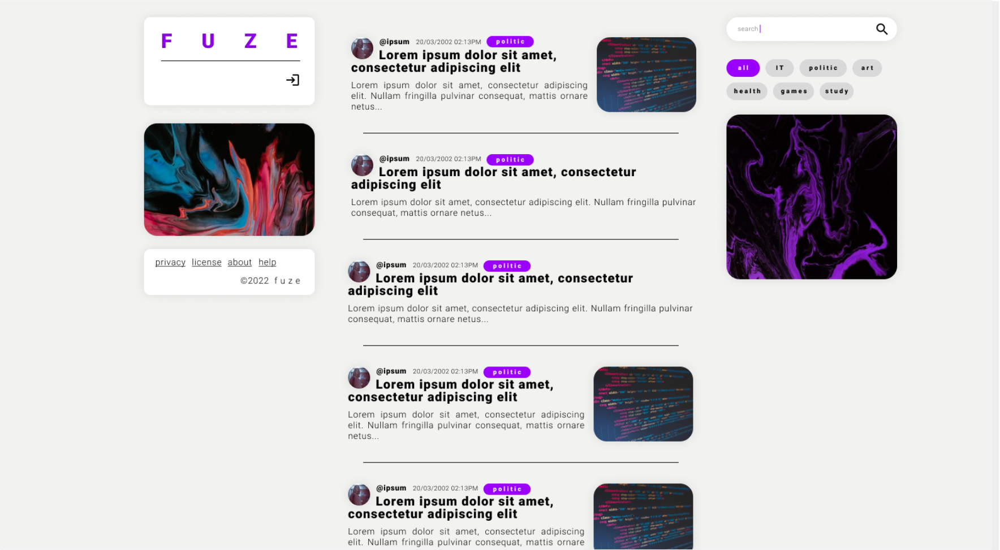
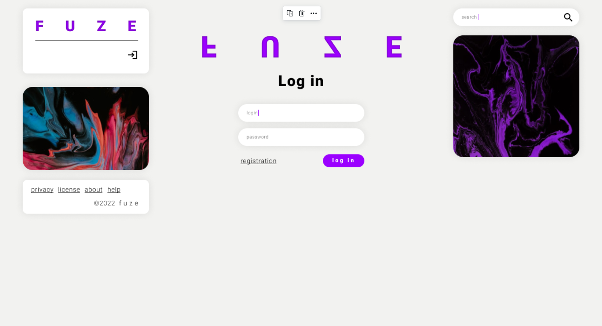
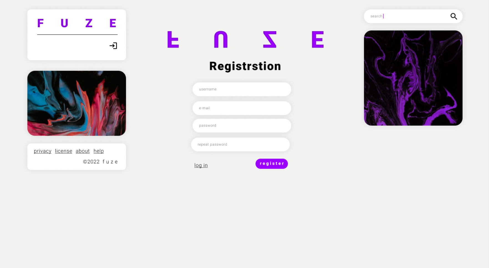
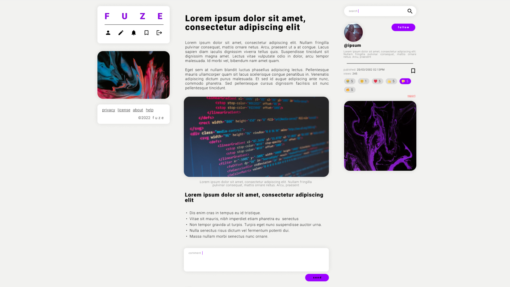
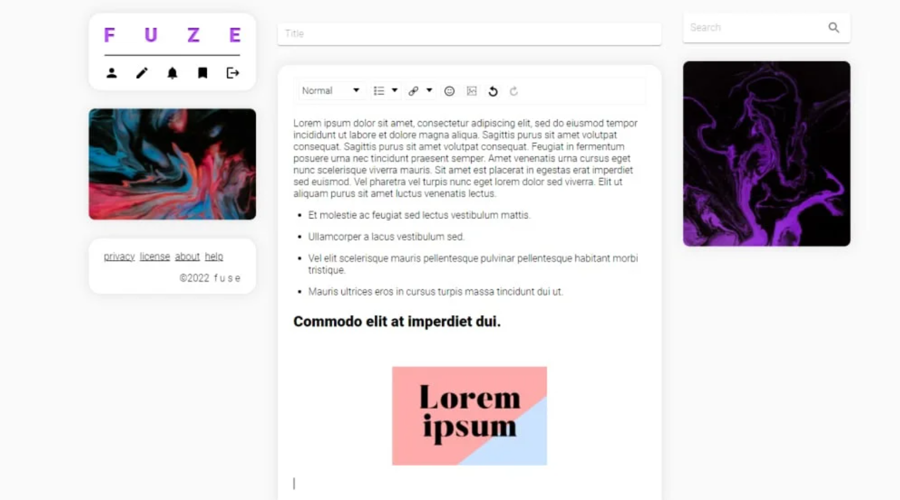
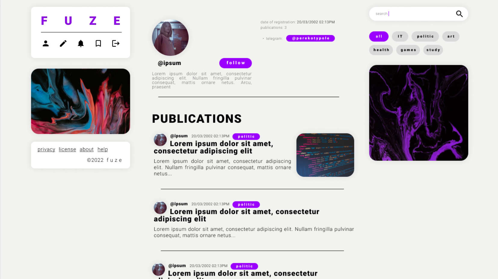
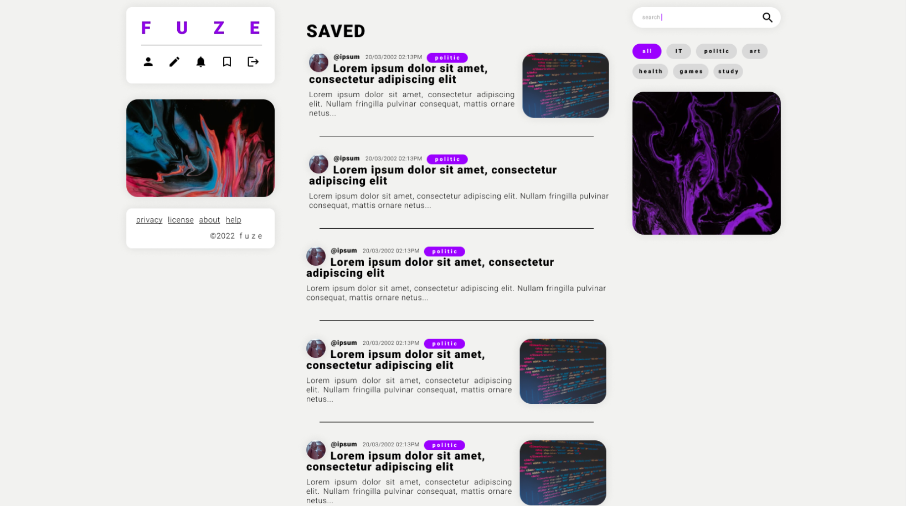

# Blog
React (Next.js), Node.js (Express), GraphQL (Apollo) and MongoDB.

Features:
- authorization
- post creation
- topics
- comments
- reactions on posts
- searching

## Client side
Libs and tool:
- React
- Next.js
- Apollo Client
- MUI
- React Draft Wysiwyg

## Server side
Libs and tools:
- Node.js
- Express
- GraphQL
- Apollo Server
- MongoDB, Mongoose
- JWT
- Babel
- ESLint

## Demo (screenshots)
Home page:

Authorization:

Posts:

Profile:

